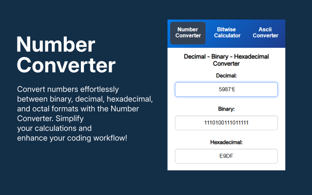
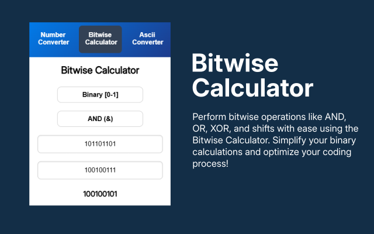
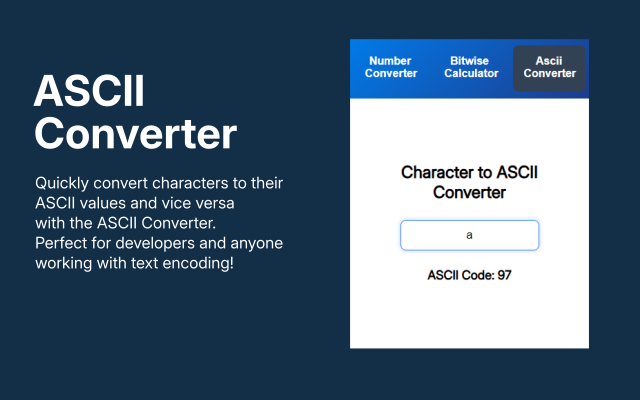

# CS Tools - Chrome Extension

🚀 **CS Tools** is a must-have Chrome extension for developers and tech enthusiasts. It provides quick access to a number system converter, a bitwise calculator, and a Char to ASCII converter—all in one convenient tool. Whether you're working on programming projects or need to quickly convert characters and numbers, CS Tools has you covered. Simplify your workflow and boost productivity with this easy-to-use extension!

## Features

-   **Number System Converter**: Effortlessly convert between binary, decimal, hexadecimal, and octal.
-   **Bitwise Calculator**: Seamlessly evaluate common bitwise expressions using tools such as AND, OR, and XOR.
-   **Char to ASCII Converter**: Quickly convert characters to their ASCII codes.

Perfect for anyone working with text encoding, programming, or just exploring number systems! 💻

---

## Screenshots

 

 

 

---

## Installation

Web Store

1. Download and install the extension from the Chrome Web Store; Search: CS Tools.
2. Once installed, click on the extension icon in your browser toolbar to start using CS Tools.
3. Use the tools directly in the extension popup for quick conversions and calculations.

Locally

1. **Clone the repository**
2. Open Google Chrome and go to: chrome://extensions/
3. Enable Developer mode using the toggle in the top right corner.
4. Click "Load unpacked"
5. Select the root directory (containing manifest.json)
6. The extension should now be loaded and active!

---

## Usage

1. **Number System Converter**: Select the input and output number system (binary, decimal, hexadecimal, or octal) and enter a value to convert.
2. **Bitwise Calculator**: Choose your operation (AND, OR, XOR, etc.), input binary numbers, and view the result instantly.
3. **Char to ASCII Converter**: Enter a character and immediately get its ASCII code, or input an ASCII code to get the corresponding character.

---
